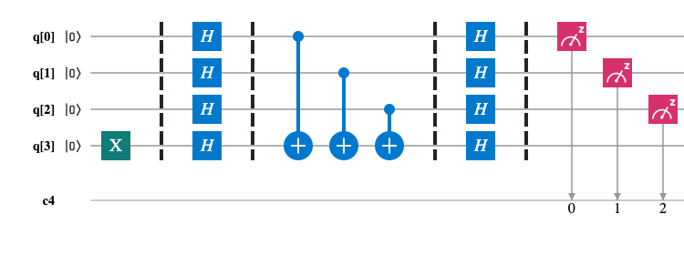
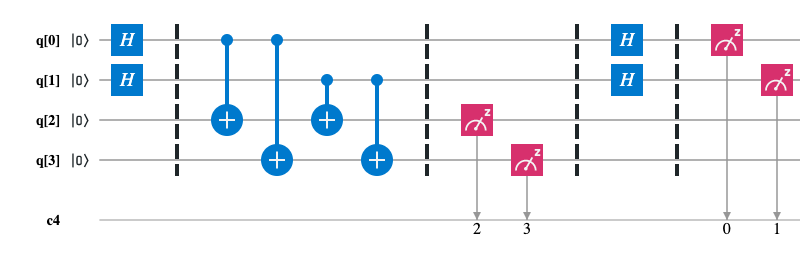
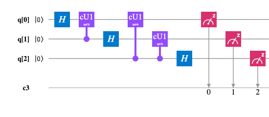

# Quantum Computing Examples

Quantum computing examples with QISKit.

## Examples

### Deutsch's Algorithm

> Problem. For given an oracle function f : {0, 1} -> {0, 1}, determine f is balanced or constant. 

### Deutsch-Jozsa Algorithm

> Problem. For given an oracle function f : {0, 1}^n -> {0, 1}, determine f is balanced or constant.

Scheme for `n=2`:

### Bernstein-Vazirani Algorithm

> Problem. For given an oracle function f : {0, 1}^n -> {0, 1}, f(x) = a x, determine a.

Scheme for `n=3`:

### Simon's Algorithm

> Problem. For given an oracle function f : {0, 1}^n -> {0, 1}^n which has period `a`: ∃!a != 0: ∀x f(x) = f(y) => y = x ⊕ a. Determine a.

Scheme for `n=2`:

### Quantum Fourier Transform (QFT)

Scheme for `n=3`:

### Superdense Coding

> Task. Transmit two bits of classical information between Alice and Bob using only one qubit.

