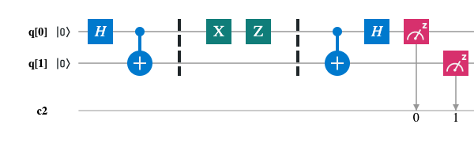
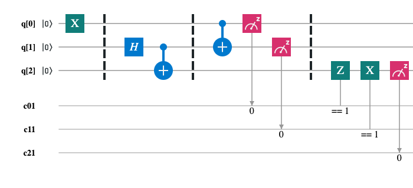
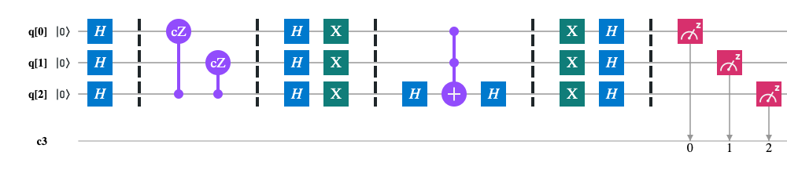
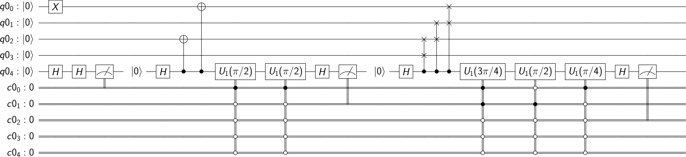
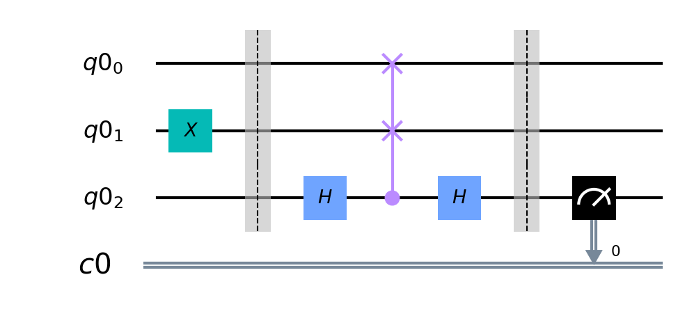

# Quantum Computing Examples

Quantum computing examples with QISKit.

## Examples

### Deutsch's Algorithm

> Problem. For given an oracle function f : {0, 1} -> {0, 1}, determine f is balanced or constant.

### Deutsch-Jozsa Algorithm

> Problem. For given an oracle function f : {0, 1}^n -> {0, 1}, determine f is balanced or constant.

Scheme for `n=2`:

### Bernstein-Vazirani Algorithm

> Problem. For given an oracle function f : {0, 1}^n -> {0, 1}, f(x) = a x, determine a.

Scheme for `n=3`:

### Simon's Algorithm

> Problem. For given an oracle function f : {0, 1}^n -> {0, 1}^n which has period `a`: ∃!a != 0: ∀x f(x) = f(y) => y = x ⊕ a. Determine a.

Scheme for `n=2`:

### Quantum Fourier Transform (QFT)

Scheme for `n=3`:

### Superdense Coding

> Task. Transmit two bits of classical information between Alice and Bob using only one qubit.

### Quantum Teleportation

> Task. Alice would like to send Bob a qubit that is in some unknown state.

### Quantum Phase Estimation

> Problem. Given an unitary operator U, estimate θ in U|ψ>=exp(2πiθ)|ψ>.

### Grover's Algorithm

> Problem. For given an oracle function f : {0, 1}^n -> {0, 1}^n, ∃! ω : f(ω) = a, find ω.

Scheme for `n=3`:

### Shor's Algorithm

> Problem. Shor's algorithm is a quantum computer algorithm for integer factorization. Informally, it solves the following problem: Given an integer N, find its prime factors.

Scheme for find the period `r` for `f(x) = 2^x mod 15`:

### Swap Test

> Task. For given two unknown quantum states, determine how much them differs.

## References

- [Jonahtan Hui, Quantum Computing Series, Medium](https://medium.com/@jonathan_hui/qc-quantum-computing-series-10ddd7977abd)

- [Qiskit, Medium](https://medium.com/qiskit)

- [Qiskit, GitHub](https://github.com/Qiskit/qiskit-terra)

- [An Introduction to Quantum Computing, Kaye, ‎Laflamme, Mosca](https://books.google.com.tr/books/about/An_Introduction_to_Quantum_Computing.html?id=8jwVDAAAQBAJ&source=kp_book_description&redir_esc=y)

- [Learn Quantum Computation using Qiskit](https://community.qiskit.org/textbook/)
